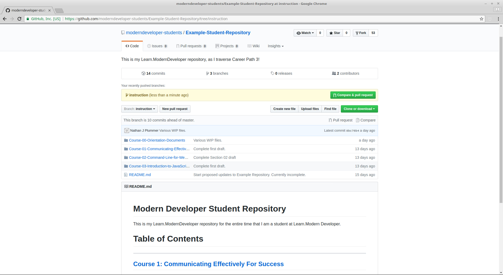
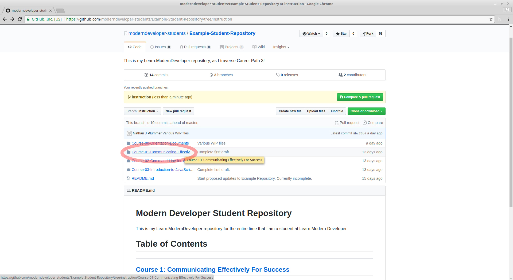
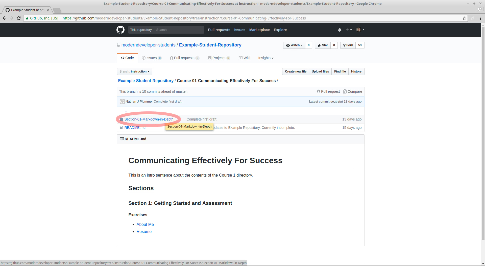
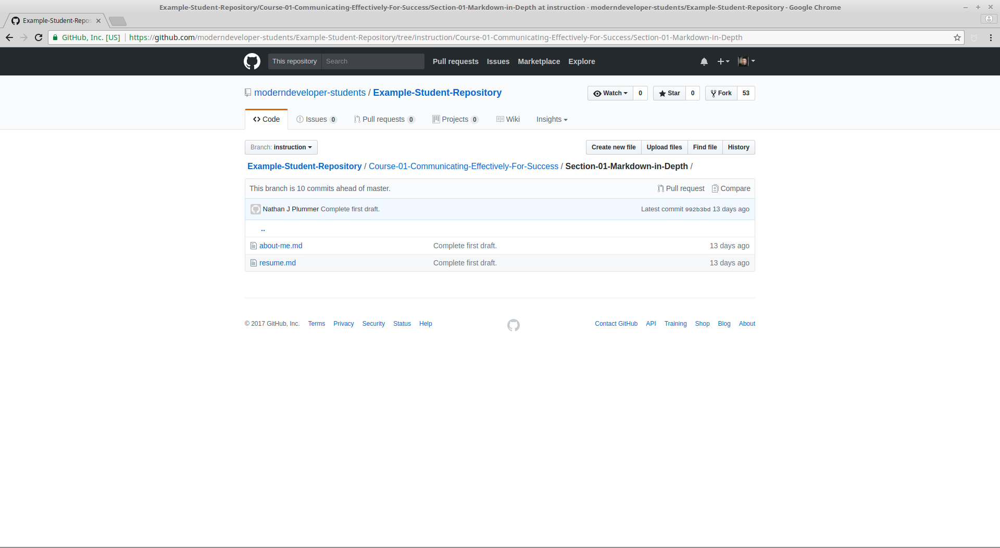
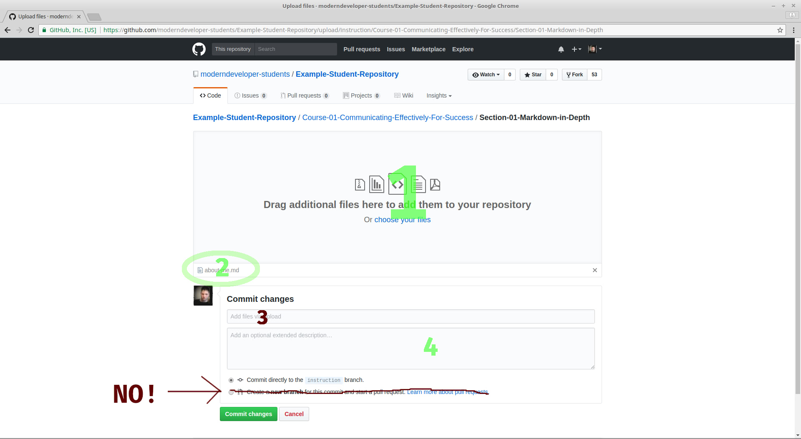

Your Bov Academy coursework  is submitted through git/GitHub.  However, unless you have previous experience with git, it reasonable to assume you may not know how to add files to your student GitHub repository before you complete the git courses.

Here, we will explain the steps for uploading your files through the GitHub web interface.

## Step 1: Head to your Student Repository

Head to your student repository.  In most cases this will be:

	https://github.com/moderndeveloper-students/coursework-
	
Followed by your GitHub username after the "coursework-"

For example, for student with the GitHub name SteveTheRogers:

	https://github.com/moderndeveloper-students/coursework-SteveTheRogers  

## Step 2: Navigate to the Folder you wish to upload to

From your GitHub page, **navigate to the folder you wish to upload your file to**.  For this example, we'll uploading your about-me.md file in the Chapter "Markdown in Depth".

## Step 3: Select Upload Button

Above your repository name, you'll see an upload button.  Click on that.

## Step 4- Drag and Drop Files

The next screen will look like this:

- Drag and drop your files you wish to upload to section "1"
- A list of your selected files will pop up at section "2"
- If you are unfamiliar with git commits, leave section 3 to its default.
- For section for add the name of the file or files you are uploading
	- Example: 
		- "about-me.md"
	- Another example: 
		- "about-me.md, resume.md"

For the next section, leave the "Commit directly to (current) branch section checked.  We will explain branches later.  For now, you are working completely from your master branch.

Once you are ready click the green "Commit changes" button at the bottom.